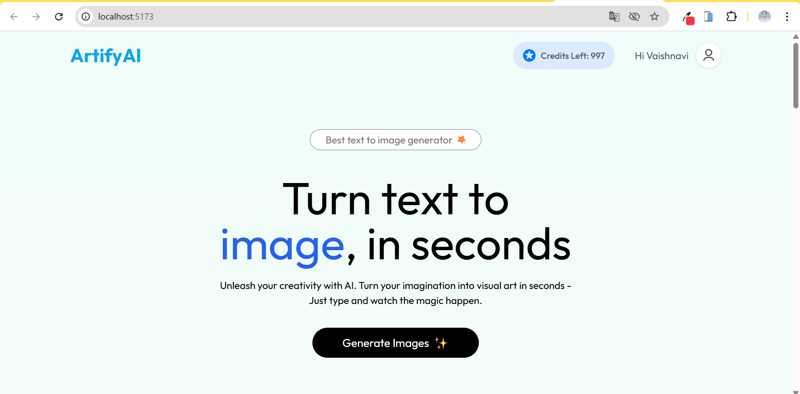

# ArtifyAI
ArtifyAI is a website where users can enter a text prompt, and based on that input, it generates a unique image. Users can also download the generated images and use them whenever they want.

## Tech Stack 
1. JavaScript
2. React
3. Tailwind CSS
4. Express
5. MongoDB
6. Git & GitHub
7. Vercel
   
## View Project
[URl](https://artify-ai-azure.vercel.app/) (Deployed on Vercel) 

## Check Out the Slides
**1. Home Page**

  

**2. Enter Prompt to generate image**

  

**output**

  

